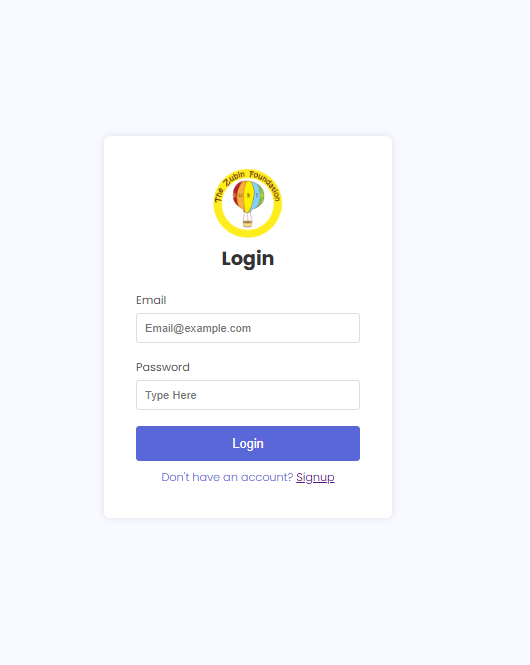
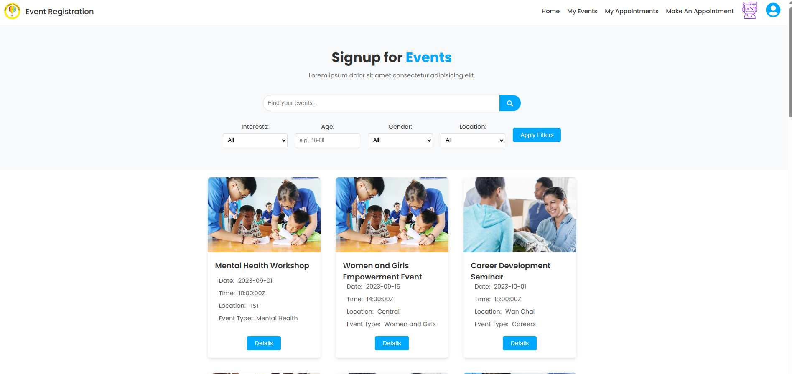
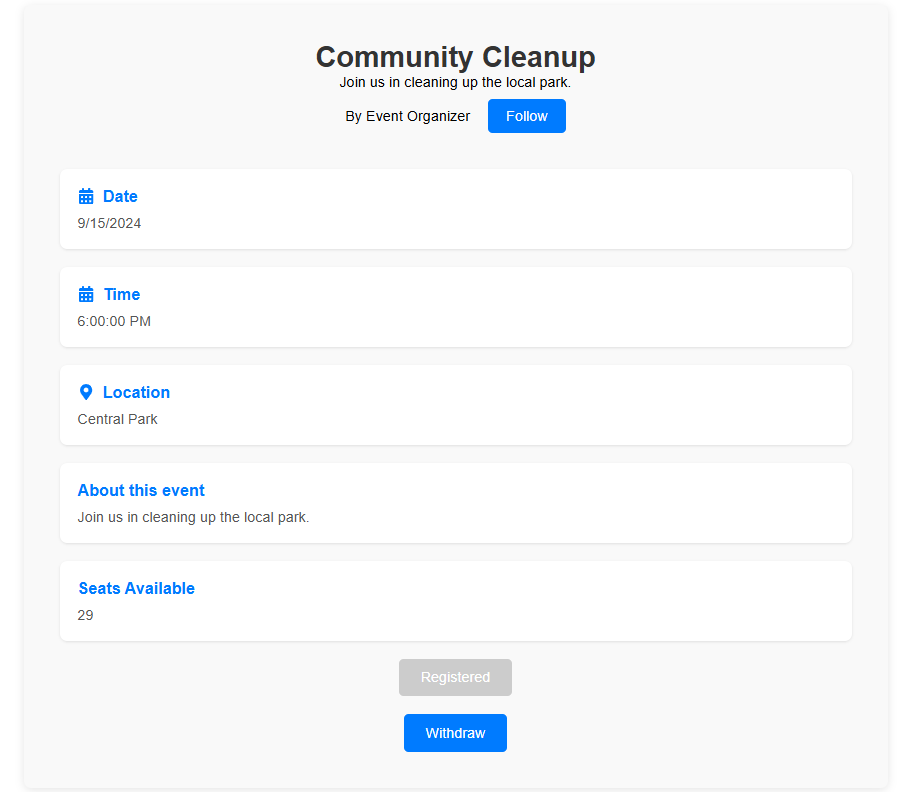
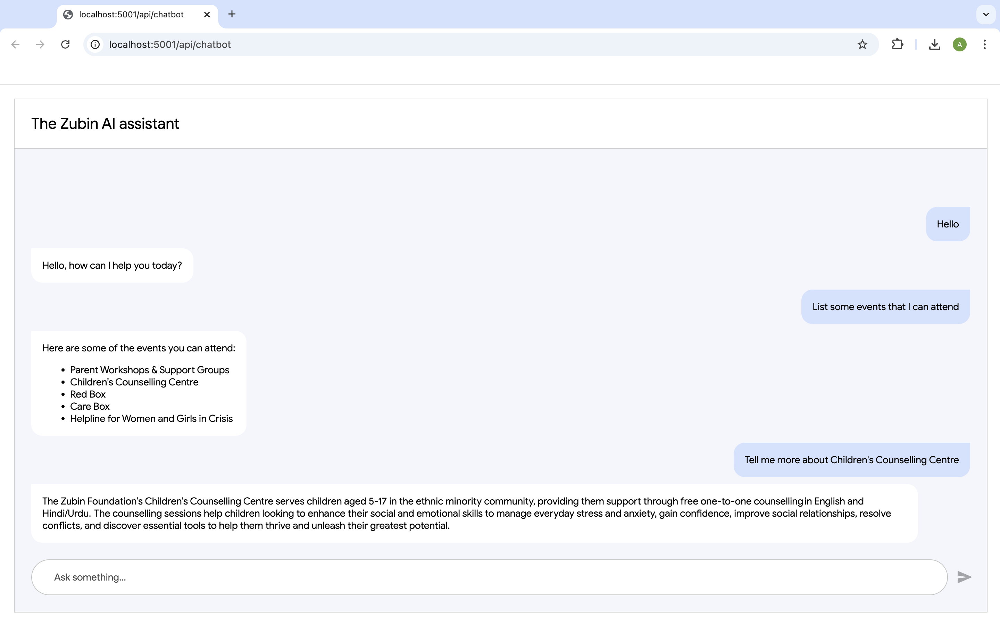
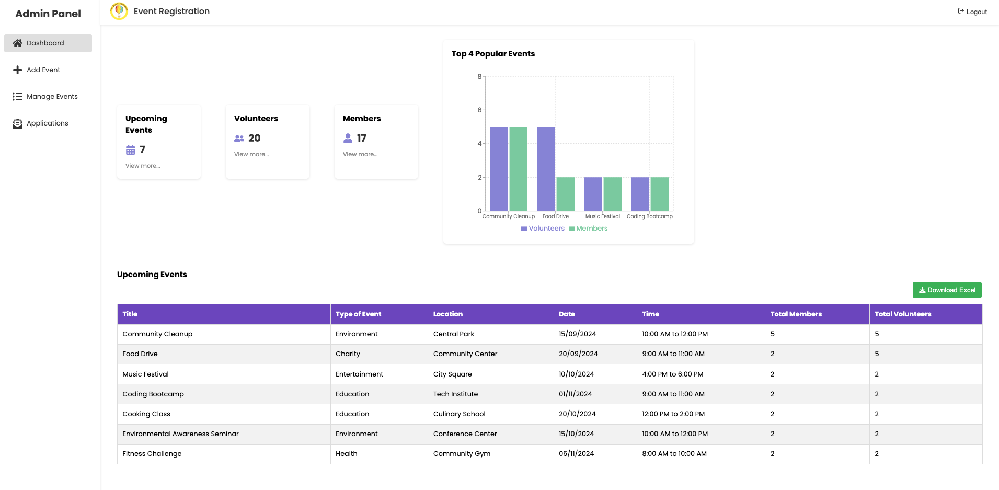
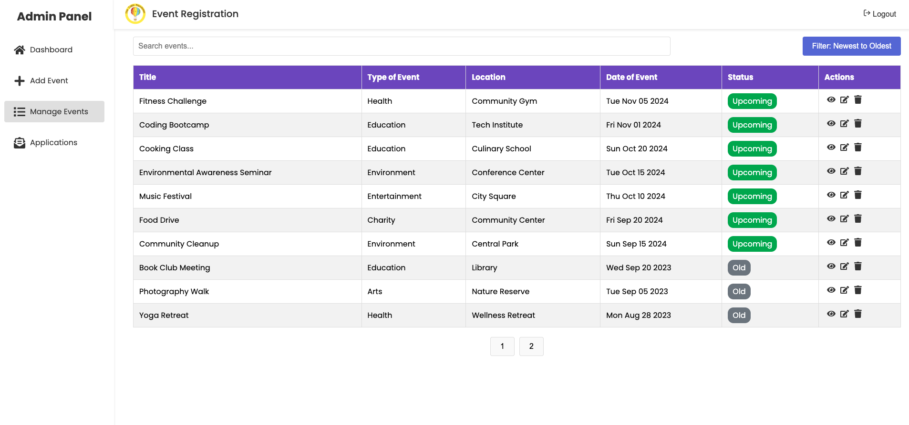
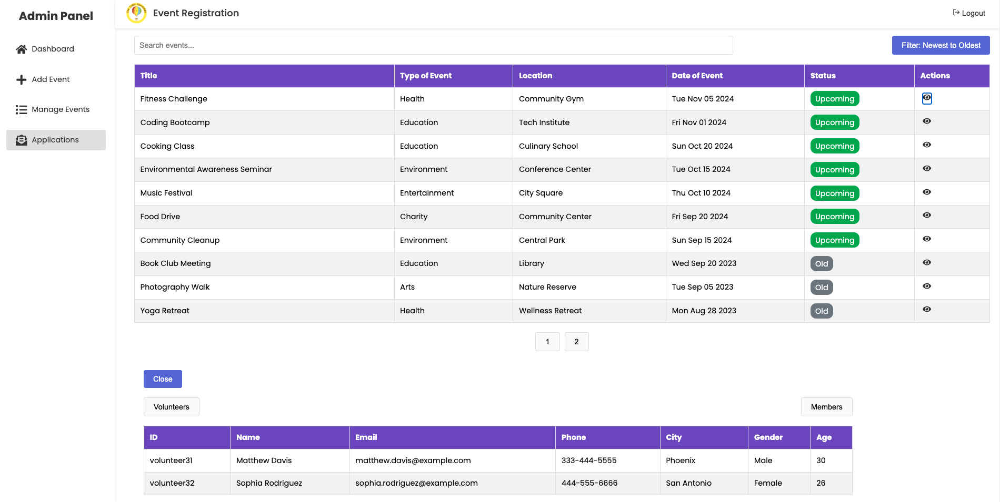

# Event Registration System - Zubin Foundation


A comprehensive event registration and management system built with Django (backend) and React (frontend) for the Zubin Foundation, designed to facilitate event management, volunteer coordination, and participant engagement with integrated AI chatbot assistance.

The Event Registration System is designed to streamline event management for the Zubin Foundation, which focuses on improving the lives of Hong Kong's ethnic minorities. The platform supports three user types: Administrators, Volunteers, and Participants, each with tailored functionality to manage events, appointments, and training materials. The system includes an AI-powered chatbot assistant to help users with event registration, training materials, and event details.

💡 Achievement:
This project was developed during the Morgan Stanley Code to Give Hackathon, where it was awarded 2nd Runner-Up.

---


## 📋 Table of Contents

- [Screenshots](#screenshots)
- [Features](#-features)
- [Technology Stack](#technology-stack)
- [Installation](#installation)
- [User Roles](#user-roles)
- [Notification System](#notification-system)
- [License](#license)

---

## Screenshots

### Login

### Home

### Event Details

### Chatbot

### Admin Dashboard

### Manage Events

### Manage Event Application


---

## ✨ Features

### For All Users
- User authentication and authorization
- Profile management
- Event browsing and search functionality
- Event filtering by interests, location, gender, and age
- Responsive design for mobile and desktop
- **AI Chatbot Assistant** (Dialogflow CX & Telegram Bot)
  - Multi-language support (English & Traditional Chinese)
  - Event registration assistance
  - Training material retrieval
  - Event detail inquiries
  - Natural language processing for user queries

### For Participants
- Browse and register for events
- View registered events
- Withdraw from events
- Make and manage appointments
- Receive event notifications via WhatsApp and SMS
- Access chatbot assistance via web interface and Telegram

### For Volunteers
- All participant features
- Access to training materials
- Track training completion
- View event readiness status
- Event-specific learning resources
- Chatbot assistance for event-related queries

### For Administrators
- Dashboard with analytics
- Create and manage events
- View event applications
- Manage event capacity
- Send automated notifications
- View registered users for events

---

## 🛠 Technology Stack

### Backend
- **Framework**: Django 5.1
- **Database**: PostgreSQL
- **API**: Django REST Framework
- **Authentication**: Session-based authentication
- **Task Queue**: Celery (for scheduled notifications)
- **Notifications**: Twilio (WhatsApp & SMS)

### AI & Chatbot
- **Conversational AI**: Google Dialogflow CX
- **Telegram Integration**: python-telegram-bot
- **NLP**: Google Cloud Natural Language API
- **Multi-language Support**: English & Traditional Chinese

### Frontend
- **Framework**: React 18
- **Routing**: React Router v6
- **Styling**: Styled Components
- **Form Management**: Formik
- **Validation**: Yup
- **HTTP Client**: Axios
- **UI Components**: Material-UI
- **Chatbot Widget**: Dialogflow Messenger

### DevOps
- **Containerization**: Docker & Docker Compose
- **Database**: PostgreSQL (via Docker)

---

## 🚀 Installation

### Prerequisites
- Docker Desktop
- Node.js (v18 or higher)
- Python 3.11+
- PostgreSQL (if running without Docker)
- **Google Cloud Account** (for Dialogflow CX)
- **Telegram Bot Token** (for Telegram integration)

### Backend Setup (Docker)

1. **Clone the repository**
```bash
git clone https://github.com/AsadNaveed1/EventRegistration-ZubinFoundation.git
cd EventRegistration-ZubinFoundation
```

2. **Navigate to server directory**
```bash
cd server
```

3. **Pull PostgreSQL image**
```bash
docker pull postgres
```

4. **Build and start Docker containers**
```bash
docker compose up -d --build
```

5. **Verify services are running**
- Open Docker Desktop and check if both backend and database services are running
- If services crash, check logs for errors

### Frontend Setup

1. **Navigate to client directory**
```bash
cd ../client
```

2. **Install dependencies**
```bash
npm install
```

3. **Start development server**
```bash
npm run dev
```

The application will be available at `http://localhost:5173`

---

## 👥 User Roles

### Administrator
- Full access to event management
- View analytics and dashboard
- Manage applications
- Send notifications to participants

**Capabilities:**
- Create, edit, and delete events
- View registered users for events
- Access admin dashboard with statistics
- Manage event capacity and settings

### Volunteer
- Register for events
- Access training materials
- View event readiness status
- Complete required training before events
- Chat with AI assistant for help

**Capabilities:**
- Browse and register for volunteer opportunities
- Access event-specific training resources
- Track training completion
- View personal event schedule
- Use chatbot for quick queries

### Participant
- Register for events
- Make appointments
- View registered events
- Receive notifications
- AI chatbot assistance

**Capabilities:**
- Browse and search events
- Register/withdraw from events
- Book appointments with foundation staff
- Receive WhatsApp/SMS notifications
- Get instant help via chatbot

---

## 📱 Notification System

The system uses Twilio to send automated notifications via:
- **WhatsApp**: Event registration confirmations and reminders
- **SMS**: Event registration confirmations and reminders

Messages are automatically sent when:
1. A user registers for an event
2. An event reminder is triggered (configurable timing)

---

## 📄 License

This project is proprietary software developed for the Zubin Foundation.

